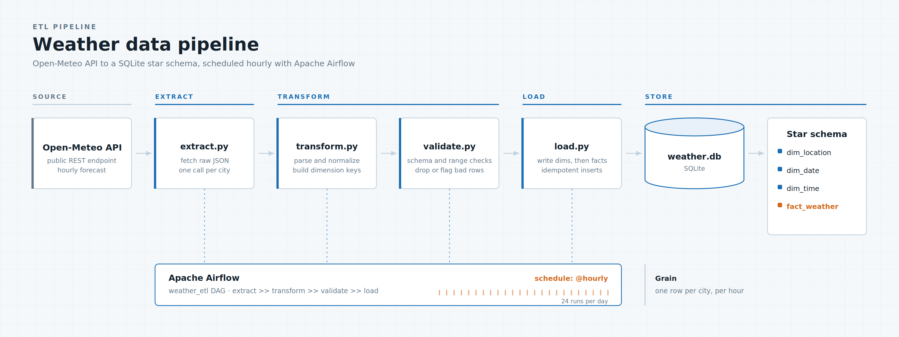
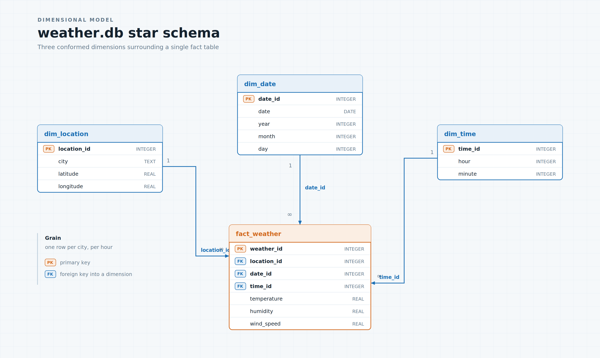
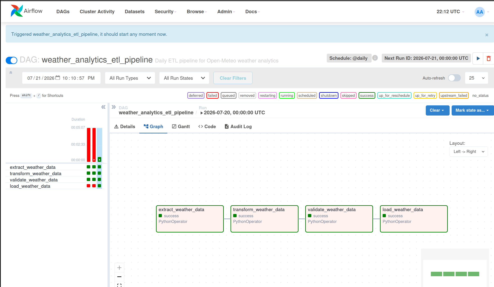
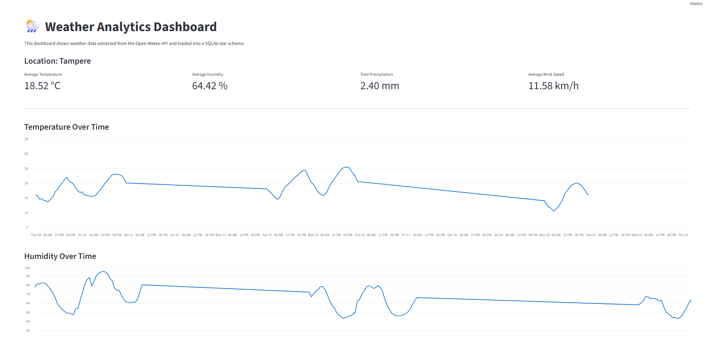

# 🌦️ Weather Analytics ETL Pipeline

A Data Engineering project that extracts weather data from the Open-Meteo API, validates and transforms it, loads it into a SQLite Star Schema, and automates execution with Apache Airflow.

## Architecture



```text
Open-Meteo API
      ↓
Extract
      ↓
Transform
      ↓
Validate
      ↓
SQLite Star Schema
      ↓
Analytics Queries
      ↓
Airflow Scheduler
```

## Tech Stack

* Python
* Pandas
* SQLite
* SQL
* Pytest
* Apache Airflow
* Docker Compose
* Streamlit

## Features

✅ API Data Extraction

✅ Data Transformation

✅ Data Quality Validation

✅ SQLite Star Schema

✅ ETL Workflow

✅ ELT Workflow

✅ Airflow Automation

✅ Streamlit Dashboard

✅ Unit Testing with Pytest

## Project Structure

```text
weather-etl-pipeline/

├── airflow/
├── dashboard/
├── data/
├── logs/
├── sql/
├── src/
├── tests/
├── main.py
├── main_elt.py
└── README.md
```

## Quick Start

Install dependencies:

```bash
pip install -r requirements.txt
```

Run ETL:

```bash
python main.py
```

Run ELT:

```bash
python main_elt.py
```

Run Dashboard:

```bash
streamlit run dashboard/app.py
```

Run Tests:

```bash
pytest
```

## Star Schema



### Tables

* dim_location
* dim_date
* dim_time
* fact_weather
* stg_weather_raw

## Airflow



DAG Tasks:

```text
extract_weather_data
        ↓
transform_weather_data
        ↓
validate_weather_data
        ↓
load_weather_data
```

## Dashboard



The dashboard displays:

* Temperature trends
* Humidity trends
* Precipitation metrics
* Wind speed metrics
* Raw weather records

## Future Improvements

* PostgreSQL
* CI/CD with GitHub Actions
* Cloud deployment
* Multi-location support
* Power BI integration

## Author

Hamza Sentongo
Master's Student in Data Science | Aspiring Data Engineer
